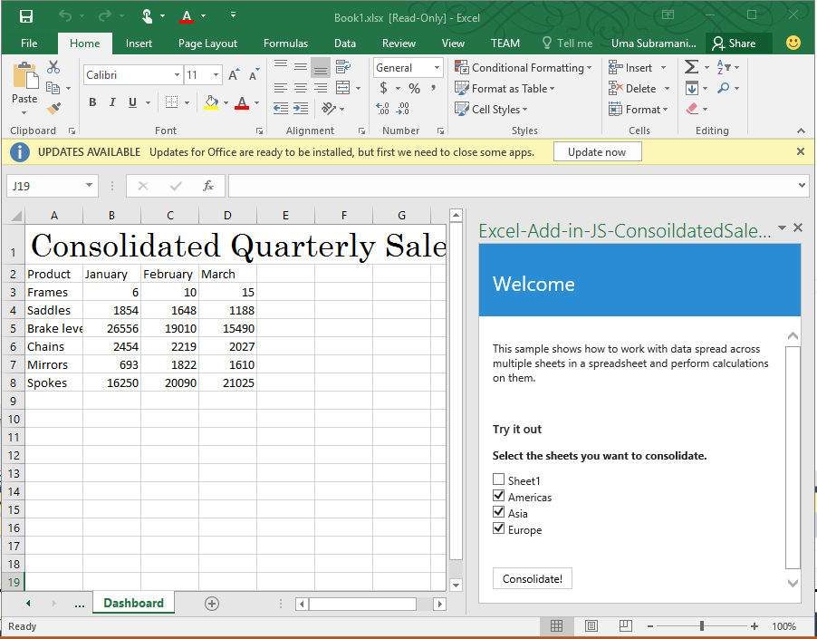
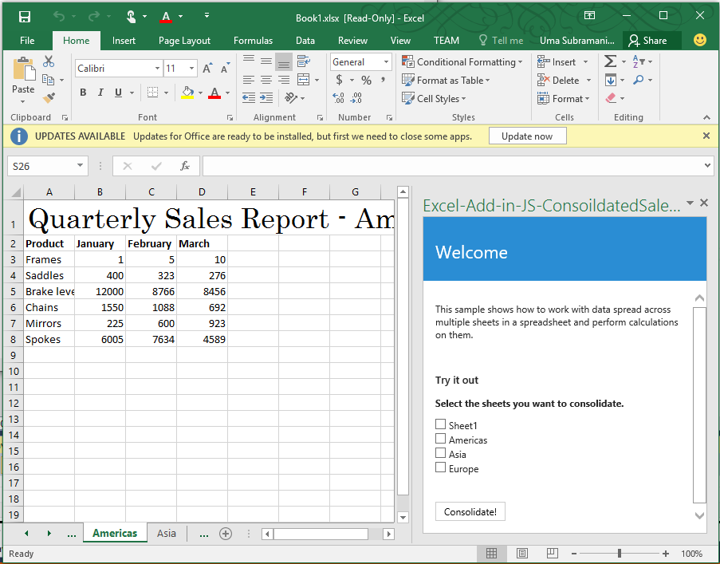

# Aufgabenbereich-Add-In-Beispiel für konsolidierten Umsatzbericht für Excel 2016

_Gilt für: Excel 2016_

Dieses Aufgabenbereich-Add-In zeigt, wie Daten aus mehreren Arbeitsblättern mithilfe der JavaScript-APIs in Excel 2016 zusammengeführt werden können. Es ist in zwei Versionen verfügbar: Code-Editor und Visual Studio.

## Probieren Sie es aus
### Code-Editor-Version

Am einfachsten können Sie Ihr Add-In bereitstellen und testen, indem Sie die Dateien in eine Netzwerkfreigabe kopieren.

1.  Hosten Sie die Dateien im Code-Editor-Projekt mithilfe eines Servers Ihrer Wahl.
2.  Bearbeiten Sie die Elemente \<SourceLocation\> und \<URL\> der Manifestdatei (ConsolidatedSaleReportManifest.xml) so, dass sie auf den gehosteten Speicherort aus Schritt 1 zeigt (https://localhost/consolidatedsalesreport/home.html).
3.  Kopieren Sie das Manifest (ConsolidatedSalesReportManifest.xml) in eine Netzwerkfreigabe (z. B. \\\MyShare\MyManifests).
4.  Fügen Sie den Freigabepfad, unter dem das Manifest enthalten ist, als vertrauenswürdigen App-Katalog in Excel hinzu.

    a.  Starten Sie Excel, und öffnen Sie ein leeres Arbeitsblatt.

    b.  Klicken Sie auf die Registerkarte **Datei**, und klicken Sie dann auf **Optionen**.

    c.  Wählen Sie **Sicherheitscenter** aus, und klicken Sie dann auf die Schaltfläche **Einstellungen für das Sicherheitscenter**.

    d.  Klicken Sie auf **Vertrauenswürdige Add-in-Kataloge**.

    e.  Geben Sie im Feld  **Katalog-URL** den Pfad zu der in Schritt 3 erstellten Netzwerkfreigabe ein, und klicken Sie auf **Katalog hinzufügen**.

   f. Aktivieren Sie das Kontrollkästchen **Im Menü anzeigen**, und wählen Sie dann **OK**. Eine Meldung wird angezeigt, dass Ihre Einstellungen angewendet werden, wenn Office das nächste Mal gestartet wird.

5.  Testen und führen Sie das Add-In aus.

    a.  Klicken Sie auf der Registerkarte **Einfügen** in Excel 2016 auf **Meine-Add-Ins**.

    b.  Wählen Sie im Dialogfenster **Office-Add-Ins** die Option **Freigegebener Ordner** aus.

    c.  Wählen Sie **Beispiel für konsolidierten Umsatzbericht**>**Einfügen**. Das Add-In wird in einem Aufgabenbereich rechts neben dem aktuellen Arbeitsblatt geöffnet, wie in der folgenden Abbildung dargestellt.

   

    d.  Aktivieren Sie die Kontrollkästchen „Nord-und Südamerika“, „Asien“ und „Europa“, und klicken Sie auf Schaltfläche **Konsolidieren**.  Dadurch wird die neues Arbeitsblatt „Dashboard“ erstellt, das eine Zusammenfassung aller ausgewählten Blätter darstellt.

  

### Visual Studio-Version
1.  Kopieren Sie das Projekt in einen lokalen Ordner, und öffnen Sie die Datei „Excel-Add-in-JS-ConsolidatedSalesReport.sln“ in Visual Studio.
2.  Drücken Sie F5, um das Beispiel-Add-In zu erstellen und bereitzustellen. Excel wird gestartet und das Add-In wird in einem Aufgabenbereich rechts neben einem leeren Arbeitsblatt geöffnet, wie in der folgenden Abbildung dargestellt.

   

    d.  Aktivieren Sie die Kontrollkästchen „Nord-und Südamerika“, „Asien“ und „Europa“, und klicken Sie auf Schaltfläche **Konsolidieren**.  Dadurch wird die neues Arbeitsblatt „Dashboard“ erstellt, das eine Zusammenfassung aller ausgewählten Blätter darstellt.

  

### Weitere Informationen

1.  [Programmierungsübersicht für Excel-Add-Ins](https://github.com/OfficeDev/office-js-docs/blob/master/excel/excel-add-ins-programming-overview.md)
2.  [Codeausschnitt-Explorer für Excel](http://officesnippetexplorer.azurewebsites.net/#/snippets/excel)
3.  [Codebeispiele zu Excel-Add-Ins](https://github.com/OfficeDev/office-js-docs/blob/master/excel/excel-add-ins-code-samples.md)
4.  [JavaScript-API-Referenz zu Excel-Add-Ins](https://github.com/OfficeDev/office-js-docs/blob/master/excel/excel-add-ins-javascript-reference.md)
5.  [Erstellen Ihres ersten Excel-Add-Ins](https://github.com/OfficeDev/office-js-docs/blob/master/excel/build-your-first-excel-add-in.md)