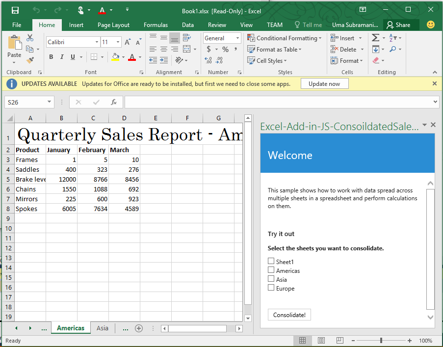

# 适用于 Excel 2016 的合并销售额报表任务窗格外接程序示例

_适用于：Excel 2016_

此任务窗格外接程序介绍如何在 Excel 2016 中使用 JavaScript API 合并多个工作表的数据。它有两种类型：代码编辑器和 Visual Studio。

## 尝试一下
### 代码编辑器版本

部署和测试外接程序的最简单方法是将文件复制到网络共享中。

1.  使用你选择的服务器托管代码编辑器项目文件夹中的文件。
2.  编辑清单文件 (ConsolidatedSaleReportManifest.xml) 中的 \<SourceLocation\> 和 \<Url\> 元素，使其指向第 1 步中的托管位置（例如，https://localhost/consolidatedsalesreport/home.html）
3.  将清单文件 (ConsolidatedSalesReportManifest.xml) 复制到网络共享（例如，\\\MyShare\\MyManifests）中。
4.  添加将清单作为 Excel 中受信任的应用目录的共享位置。

    a.启动 Excel 并打开一个空白的电子表格。

    b.依次选择“**文件**”选项卡和“**选项**”。

    c.依次选择“**信任中心**”和“**信任中心设置**”按钮。

    d.选择“**受信任的外接程序目录**”。

    e.在“**目录 URL**”框中，输入你在第 3 步中创建的网络共享路径，然后选择“**添加目录**”。

   f.  选中“**显示在菜单中**”复选框，然后选择“**确定**”。此时，系统会显示一条消息，提醒你注意你的设置将在 Office 下次启动时应用。

5.  测试并运行外接程序。

    a.在 Excel 2016 的“**插入**”选项卡中，选择“**我的外接程序**”。

    b.在“**Office 外接程序**”对话框中，选择“**共享文件夹**”。

    c.依次选择“**合并销售额报表示例**”>“**插入**”。此时，系统会在当前工作表右侧的任务窗格中打开外接程序，如下图所示。

   

    d.选中“美洲”、“亚洲”和“欧洲”复选框，然后单击“**合并!**”按钮。这会新建一个仪表板工作表，用于显示全部选定工作表的摘要视图。

  

### Visual Studio 版本
1.  将项目复制到本地文件夹，并在 Visual Studio 中打开 Excel-Add-in-JS-ConsolidatedSalesReport.sln。
2.  按 F5 生成并部署示例外接程序。Excel 启动并且外接程序会在空白工作簿右侧的任务窗格中打开，如下图所示。

   

    d.选中“美洲”、“亚洲”和“欧洲”复选框，然后单击“**合并!**”按钮。这会新建一个仪表板工作表，用于显示全部选定工作表的摘要视图。

  

### 了解详细信息

1.  [Excel 外接程序编程概述](https://github.com/OfficeDev/office-js-docs/blob/master/excel/excel-add-ins-programming-overview.md)
2.  [适用于 Excel 的代码段资源管理器](http://officesnippetexplorer.azurewebsites.net/#/snippets/excel)
3.  [Excel 外接程序代码示例](https://github.com/OfficeDev/office-js-docs/blob/master/excel/excel-add-ins-code-samples.md)
4.  [Excel 外接程序 JavaScript API 参考](https://github.com/OfficeDev/office-js-docs/blob/master/excel/excel-add-ins-javascript-reference.md)
5.  [生成你的第一个 Excel 外接程序](https://github.com/OfficeDev/office-js-docs/blob/master/excel/build-your-first-excel-add-in.md)